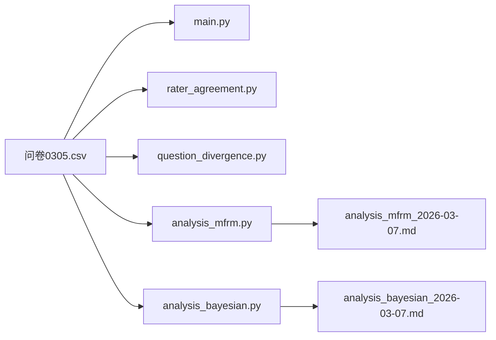

# rater-analysis

## Files

- **main.py** - Main entry point for rater analysis
- **rater_agreement.py** - Inter-rater agreement/reliability analysis
- **question_divergence.py** - Analysis of question-level divergence across raters
- **analysis_mfrm.py** - Many-Facet Rasch Model (MFRM) analysis: estimates dialog quality, rater severity, and item difficulty via iterative least-squares, producing fair scores adjusted for rater/item effects
- **analysis_mfrm_2026-03-07.md** - MFRM analysis report output (generated)
- **analysis_bayesian.py** - Hierarchical Bayesian analysis using mixed linear model (REML): estimates dialog quality with credible intervals, rater bias, and question effects via empirical Bayes shrinkage
- **analysis_bayesian_2026-03-07.md** - Bayesian analysis report output (generated)
- **问卷0305.csv** - Raw rater scoring data (input)

## File Relationships

